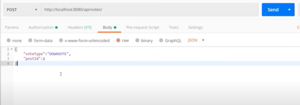

# SpringAngularProject

This project is an effort to mimic the backend implementation of spring reddit application. Here are the APIs and their
features which were built while implementing this project.

1. User registration:
   endpoint: `api/auth/signup`
   This will consume the user details required for signup i.e the username, email and password. After the user details
   are entered, it will create a user in the database with an encoded password.
   
   

2. User login and user authentication using JWT:
   endpoint: `api/auth/login`
   On validation of the user, the server will give an authentication token and username as response back from 
   the server. 
   
   
3. Validating the JWT: 
   After gettig the token as a response in our previous step of development, as a next step we use this token
   in the bearer scheme and create a subreddit.
   
   
4. Creating and retrieving a reddit post: 
   endpoint: `{POST}api/posts`
   
   similarly we can retrieve the created post from the ID associated with that post
   
  
5. Adding a comment: 
   endpoint: `{POST}api/comments`
   A user can add a comment on a post using the the "postid" in the req payload: 
   
   
6. Similarly all the comments added on a post can be retrieved: 
   endpoint: `api/comments/by-post/3`
   
   
7. Any POST created can be upvoted or downvoted: 
   endpoint: `{POST}api/votes/`
   
   
   and the endpoint `{GET}api/posts/` can be used to fetch all the votecount which is the summation of downvotes
   and upvotes made on any post.
   
That is it, this was the backend APIs required for building a reddit application.
Do let me know if you feel there can be any additions to this implementation.

Thanks,
Prashad